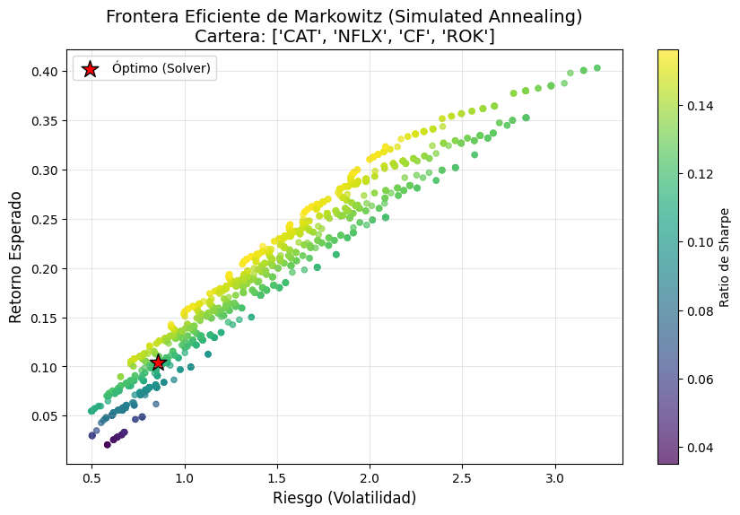
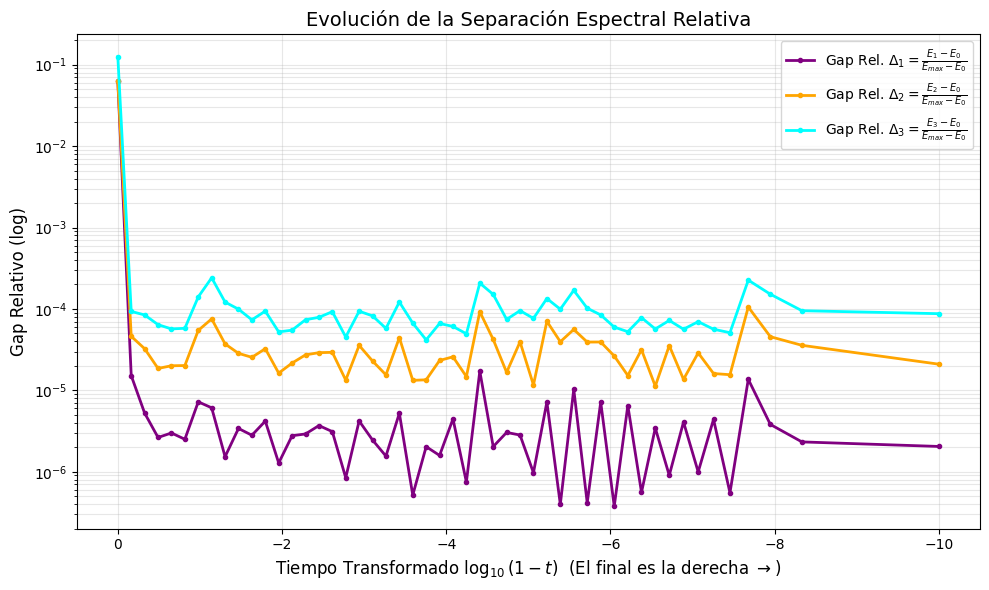

#  Resolución del Problema de Optimización de Carteras de Inversión mediante un Enfoque Clásico y Cuántico
**Trabajo de Fin de Grado (TFG) | Grado en Física**


##  Descripción del Proyecto
Este repositorio contiene el código y los análisis desarrollados para el Trabajo de Fin de Grado (TFG) en Física sobre la aplicación del **Simulated Annealing** y de  **Computación Cuántica Adiabática** en problemas financieros reales.

El objetivo es resolver el problema de **Optimización de Carteras de Markowitz** transformándolo en un problema de optimización binaria cuadrática sin restricciones (**QUBO**) y mapeándolo a un **Hamiltoniano de Ising** para su estudio bajo los enfoques clásico y cuántico.

>  **Nota:** La parte cuántica es una **simulación numérica exacta** de la Ecuación de Schrödinger en CPU clásica para visualizar fenómenos físicos (Gap Espectral), no una ejecución en hardware cuántico real.

##  Características Principales
* **Datos Reales:** Descarga y procesamiento automático de datos de mercado (Yahoo Finance).
* **Modelo QUBO:** Formulación matemática del problema financiero con codificación logarítmica de variables (ahorro exponencial de qubits).
* **Solvers Clásicos:** Implementación de *Simulated Annealing* para encontrar la Frontera Eficiente.
* **Simulación Cuántica:** Motor físico propio (`IsingEvolver`) basado en `quimb` para simular la evolución adiabática y analizar la estabilidad del sistema.
* **Análisis de Complejidad:** Estudio de la densidad de estados y el Gap Espectral para evaluar la ventaja cuántica potencial.

##  Estructura del Repositorio
.
├── notebooks/                  # Jupyter Notebooks con la demo completa
│   └── 01_Demo_Completa_TFG.ipynb
├── src/                        # Código fuente modular
│   ├── qubo_model.py           # Formulación matemática (Finanzas -> Ising)
│   ├── solvers.py              # Solvers clásicos (Simulated Annealing / Exact)
│   └── quantum_dynamics.py     # Motor de simulación cuántica (Quimb)
├── img/                        # Gráficas generadas
├── requirements.txt            # Dependencias del proyecto
└── README.md                   # Documentación principal

##  Instalación y Uso

Para ejecutar este proyecto en tu máquina local, sigue estos pasos:

1.  **Descargar el código:**
    Abre una terminal y clona este repositorio:
    ```bash
    git clone [https://github.com/tu-usuario/TFG-Quantum-Finance.git](https://github.com/tu-usuario/TFG-Quantum-Finance.git)
    cd TFG-Quantum-Finance
    ```

2.  **Instalar las librerías necesarias:**
    Asegúrate de tener Python instalado y ejecuta:
    ```bash
    pip install -r requirements.txt
    ```

3.  **Abrir el Notebook:**
    Lanza Jupyter para ver la simulación interactiva:
    ```bash
    jupyter notebook notebooks/01_Demo_Completa_TFG.ipynb
    ```

##  Fundamento Teórico: Del Modelo Financiero al Hamiltoniano de Ising

El problema de optimización de carteras busca minimizar una función de "energía" que penaliza el riesgo y premia el retorno esperado, sujeta a restricciones presupuestarias:

$$H(\vec{n}) = -\sum_{i} \mu_i n_i + \alpha \sum_{ij} \sigma_{ij} n_i n_j + \lambda \left( B - \sum_i p_i n_i \right)^2$$

Donde $n_i$ es el número de acciones de cada activo (variable entera).

Para resolver este problema en una arquitectura de *quantum annealing*, realizamos dos transformaciones clave:

1.  **Discretización Binaria:** Convertimos las variables enteras $n_i$ en una suma de bits utilizando una expansión binaria ($n_i = \sum 2^k b_{i,k}$), lo que nos permite representar cantidades grandes con pocos qubits.

2.  **Mapeo a Ising:** Transformamos las variables binarias ($0, 1$) a variables de espín físico ($-1, +1$) mediante la relación $b_{i,k} = (s_{i,k} + 1)/2$. Esto nos permite reescribir la función de coste financiera como un **Hamiltoniano de Ising** físico:

    $$H_{Ising} = \sum h_i \sigma_z^i + \sum J_{ij} \sigma_z^i \sigma_z^j$$

    Donde los **campos locales ($h_i$)** y los **acoplamientos ($J_{ij}$)** codifican directamente los parámetros financieros (retornos, covarianzas y precios).

De esta forma, encontrar la cartera óptima equivale físicamente a encontrar el estado de mínima energía del sistema de espines.

##  Resultados Destacados

### 1. Exploración del Espacio de Soluciones (Simulated Annealing)

Esta visualización muestra el resultado de la ejecución del algoritmo de *Simulated Annealing* para un **perfil de riesgo fijo** (definido por un valor específico de $\alpha = 0.7$).

* **Nube de Soluciones:** Cada punto en la gráfica representa una cartera válida encontrada durante el proceso de optimización estocástica. La dispersión de estos puntos ilustra la capacidad del algoritmo para explorar el paisaje de energía y encontrar múltiples configuraciones cercanas al óptimo.
* **Solución Óptima:** Se destaca la cartera que minimiza la función objetivo (Hamiltoniano) para el $\alpha$ dado, representando el mejor equilibrio riesgo-retorno bajo la restricción de presupuesto encontrado por el solver clásico.



### 2. Dinámica del Gap Espectral y Fases Magnéticas

Se analiza la evolución adiabática del Hamiltoniano $H(t)$ para caracterizar las transiciones de fase del sistema, relacionando la física del modelo de Ising con la estructura del problema financiero.

1.  **Régimen Antiferromagnético (Inicio):**
    Dados los valores de los coeficientes del problema financiero (donde penalizamos las correlaciones positivas entre activos y buscamos diversificación), los acoplamientos resultan predominantemente positivos ($J_{ij} > 0$). Esto define un comportamiento inicial **antiferromagnético**, donde los espines tienden a alinearse en sentidos opuestos para minimizar la energía, favoreciendo la competencia entre activos.

2.  **Transición a Vidrio de Espín y Escala Logarítmica:**
    * **Análisis Lineal:** En una escala de tiempo lineal, observamos la evolución general del sistema. Sin embargo, esta vista pierde detalle en la región crítica final donde ocurre la localización de la solución.
    * **Análisis Logarítmico (El Régimen *Spin Glass*):** Para resolver esto, aplicamos una transformación logarítmica ($x \sim \log(1-s)$) que nos permite hacer "zoom" en el final del *annealing* ($s \to 1$). Es aquí donde la competencia entre las múltiples restricciones genera **frustración magnética**, llevando al sistema a una fase de **Vidrio de Espín (*Spin Glass*)**.
    * En este régimen desordenado, el **Gap Espectral** se cierra abruptamente y emergen las soluciones cuánticas óptimas, que corresponden a los estados de mínima energía "congelados" en este paisaje rugoso.




##  Referencias Principales

1.  **Botea, A., Bosio, M., & Lee, A. (2020).** *Portfolio Optimization using Quantum Annealing*. arXiv preprint arXiv:2012.01121. [Enlace](https://arxiv.org/abs/2012.01121)
2.  **Kochenberger, G. et al. (2014).** *The unconstrained binary quadratic programming problem: a survey*. Journal of Combinatorial Optimization, 28(1), 58-81. [Enlace](https://arxiv.org/abs/1811.11538)
3.  **D-Wave Systems Inc. (2024).** *Portfolio Optimization Example*. GitHub repository. [Enlace](https://github.com/dwave-examples/portfolio-optimization)
4.  **Kirkpatrick, S., Gelatt, C. D., & Vecchi, M. P. (1983).** *Optimization by simulated annealing*. Science, 220 (4598), 671-680. [Enlace](https://www2.stat.duke.edu/-scs/Courses/Stat376/Papers/TemperAnneal/KirkpatrickAnnealScience1983.pdf)
5.  **Farhi, E. et al. (2000).** *Quantum computation by adiabatic evolution*. arXiv. [Enlace](https://arxiv.org/pdf/quant-ph/0001106)
6.  **D-Wave Systems Inc. (2024).** *Quantum Annealing Introduction*. D-Wave Documentation. [Enlace](https://docs.dwavequantum.com/en/latest/quantum_research/quantum_annealing_intro.html)
7.  **Albash, T., & Lidar, D. A. (2014).** *Adiabatic quantum computation is equivalent to standard quantum computation*. Frontiers in Physics, 2, 5. [Enlace](https://www.frontiersin.org/articles/10.3389/fphy.2014.00005/full)
---
**Autor:** Guillermo Burges Bruna | **Grado en Física** | 2025